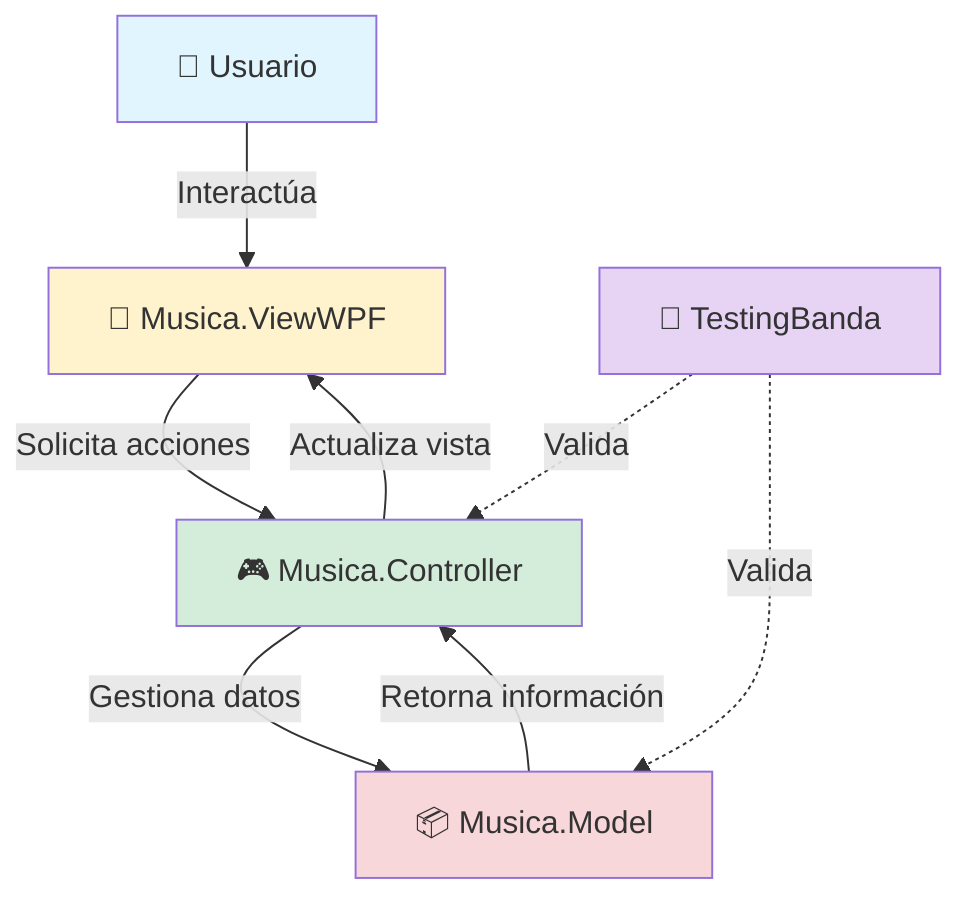
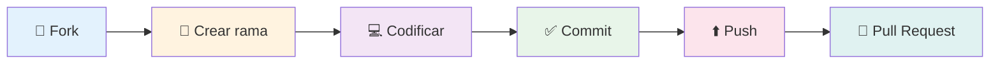

<div align="center">

# 🎼 Proyecto Final - Banda de Música 🎵

### Sistema de Gestión Musical desarrollado en C# con WPF

[](https://docs.microsoft.com/en-us/dotnet/csharp/)
[](https://dotnet.microsoft.com/)
[](https://docs.microsoft.com/en-us/dotnet/desktop/wpf/)
[](https://visualstudio.microsoft.com/)


</div>

---

## 📖 Tabla de Contenidos

- [🎯 Descripción](#-descripción)
- [✨ Características](#-características)
- [🏗️ Arquitectura](#️-arquitectura)
- [💻 Tecnologías](#-tecnologías)
- [📋 Requisitos](#-requisitos)
- [🚀 Instalación](#-instalación)
- [▶️ Ejecución](#️-ejecución)
- [🧪 Testing](#-testing)
- [🤝 Contribuir](#-contribuir)
- [👤 Autor](#-autor)

---

## 🎯 Descripción

<div align="center">

**Proyecto Final - Banda de Música** es una aplicación de escritorio robusta y elegante desarrollada en **C# con WPF** que permite gestionar toda la información relacionada con una banda de música de manera eficiente y profesional.

</div>

### 💡 ¿Qué hace este proyecto?

Este sistema implementa una solución completa siguiendo el patrón de diseño **MVC (Modelo-Vista-Controlador)**, garantizando:

- 📊 **Separación de responsabilidades** clara y mantenible
- 🎨 **Interfaz de usuario moderna** con WPF
- 🔧 **Arquitectura escalable** y profesional
- ✅ **Código testeado** con pruebas unitarias

---

## ✨ Características

<table>
<tr>
<td width="50%">

### 🎨 Interfaz Moderna
- Diseño intuitivo con WPF
- Experiencia de usuario fluida
- Interfaz responsive

</td>
<td width="50%">

### 🏗️ Arquitectura Sólida
- Patrón MVC implementado
- Código limpio y organizado
- Fácil mantenimiento

</td>
</tr>
<tr>
<td width="50%">

### 🔒 Calidad Garantizada
- Pruebas unitarias incluidas
- Código bien estructurado
- Buenas prácticas de desarrollo

</td>
<td width="50%">

### 🚀 Alto Rendimiento
- Optimizado para Windows
- Respuesta rápida
- Consumo eficiente de recursos

</td>
</tr>
</table>

---

## 🏗️ Arquitectura

<div align="center">



</div>

### 📁 Estructura del Proyecto

```
📦 Proyecto_Final_Banda_Musica
┣ 📂 Musica.Model
┃ ┗ 📋 Entidades y modelos de datos
┣ 📂 Musica.Controller
┃ ┗ 🎮 Lógica de negocio y controladores
┣ 📂 Musica.ViewWPF
┃ ┗ 🎨 Interfaces de usuario (XAML + C#)
┣ 📂 TestingBanda
┃ ┗ 🧪 Pruebas unitarias
┗ 📄 Banda_Musica.sln
  ┗ ⚙️ Solución de Visual Studio
```

<details>
<summary><b>🔍 Ver descripción detallada de cada capa</b></summary>

<br>

| Componente | Descripción | Responsabilidad |
|:----------:|:------------|:----------------|
| 📦 **Musica.Model** | Capa de Datos | Define las entidades del dominio, estructuras de datos y acceso a la información |
| 🎮 **Musica.Controller** | Capa de Lógica | Implementa las reglas de negocio, orquesta operaciones y conecta Modelo con Vista |
| 🎨 **Musica.ViewWPF** | Capa de Presentación | Maneja la interfaz gráfica, eventos de usuario y visualización de datos |
| 🧪 **TestingBanda** | Capa de Pruebas | Valida el correcto funcionamiento mediante pruebas unitarias |

</details>

---

## 💻 Tecnologías

<div align="center">

| Categoría | Tecnología |
|:---------:|:-----------|
| 🔤 **Lenguaje** | C# 8.0+ |
| 🎯 **Framework** | .NET Framework 4.7.2+ / .NET Core 3.1+ |
| 🎨 **UI Framework** | WPF (Windows Presentation Foundation) |
| 🏗️ **Patrón** | MVC (Model-View-Controller) |
| 🧪 **Testing** | MSTest / NUnit / xUnit |
| 🛠️ **IDE** | Visual Studio 2019+ |

</div>

---

## 📋 Requisitos

<table>
<tr>
<td align="center" width="33%">

<br><b>Visual Studio</b>
<br>2019 o superior
</td>
<td align="center" width="33%">

<br><b>.NET Framework</b>
<br>4.7.2 o superior
</td>
<td align="center" width="33%">

<br><b>Windows</b>
<br>7 o superior
</td>
</tr>
</table>

---

## 🚀 Instalación

### Paso 1️⃣: Clonar el repositorio

```bash
git clone https://github.com/Yonderus/Proyecto_Final_Banda_Musica.git
cd Proyecto_Final_Banda_Musica
```

### Paso 2️⃣: Abrir en Visual Studio

```bash
# Abre la solución directamente
start Banda_Musica.sln
```

O desde Visual Studio:
- `File` → `Open` → `Project/Solution`
- Navega a la carpeta y selecciona `Banda_Musica.sln`

### Paso 3️⃣: Restaurar dependencias

```bash
# Desde la consola del Administrador de Paquetes
dotnet restore
```

O en Visual Studio:
- Click derecho en la solución → `Restore NuGet Packages`

### Paso 4️⃣: Compilar

```bash
dotnet build
```

O en Visual Studio: `Ctrl + Shift + B`

---

## ▶️ Ejecución

<div align="center">

### 🎯 Método 1: Desde Visual Studio

</div>

1. Establece **Musica.ViewWPF** como proyecto de inicio
   - Click derecho en el proyecto → `Set as StartUp Project`
2. Presiona `F5` o el botón ▶️ **Start**

<div align="center">

### 🎯 Método 2: Desde la línea de comandos

</div>

```bash
cd Musica.ViewWPF
dotnet run
```

---

## 🧪 Testing

<div align="center">

### Ejecutar todas las pruebas

</div>

**Desde Visual Studio:**
```
Test → Test Explorer → Run All Tests
```

**Desde la terminal:**
```bash
dotnet test
```

**Con cobertura de código:**
```bash
dotnet test /p:CollectCoverage=true
```

---

## 🤝 Contribuir

¡Las contribuciones son siempre bienvenidas! 💙

<div align="center">

### 🔄 Flujo de Contribución

</div>



### 📝 Pasos detallados

1. **Fork** del proyecto
2. Crea tu **Feature Branch**
   ```bash
   git checkout -b feature/NuevaCaracteristica
   ```
3. **Commit** tus cambios
   ```bash
   git commit -m '✨ Add: Nueva característica increíble'
   ```
4. **Push** a la rama
   ```bash
   git push origin feature/NuevaCaracteristica
   ```
5. Abre un **Pull Request** 🎉

### 💡 Convención de Commits

| Emoji | Código | Descripción |
|:-----:|:-------|:------------|
| ✨ | `:sparkles:` | Nueva característica |
| 🐛 | `:bug:` | Corrección de bugs |
| 📝 | `:memo:` | Documentación |
| ♻️ | `:recycle:` | Refactorización |
| 🎨 | `:art:` | Mejoras de UI/UX |
| ⚡ | `:zap:` | Mejora de rendimiento |
| 🧪 | `:test_tube:` | Añadir tests |

---

## 📄 Licencia

<div align="center">

Este proyecto está disponible como **código abierto**.

Si deseas especificar una licencia, considera usar:

[](https://choosealicense.com/licenses/mit/)
[](https://opensource.org/licenses/)
[](https://opensource.org/licenses/Apache-2.0)

</div>

---

## 👤 Autor

<div align="center">


### **Yonderus**

[](https://github.com/Yonderus)
[](mailto:tu-email@ejemplo.com)

</div>

---

## 📞 Soporte

<div align="center">

¿Necesitas ayuda? ¡Estamos aquí para ti!

[](https://github.com/Yonderus/Proyecto_Final_Banda_Musica/issues)
[](https://github.com/Yonderus/Proyecto_Final_Banda_Musica/discussions)

</div>

---

<div align="center">

### 💖 ¿Te ha gustado el proyecto?

Si este proyecto te ha sido útil, considera darle una ⭐️

<br>

**Desarrollado con** ❤️ **y mucho** ☕

<br>


---

**© 2026 Yonderus - Proyecto Final Banda de Música**

</div>
